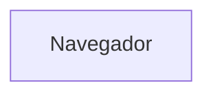
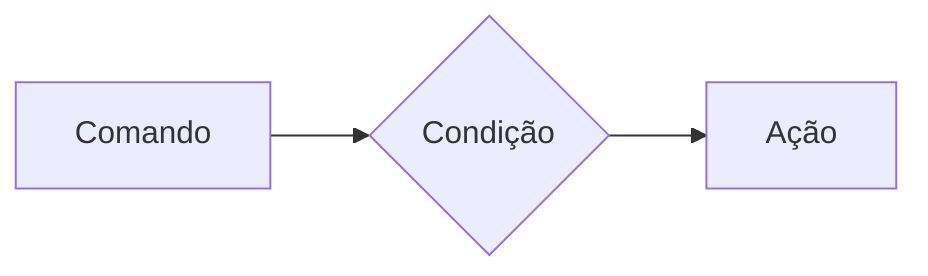
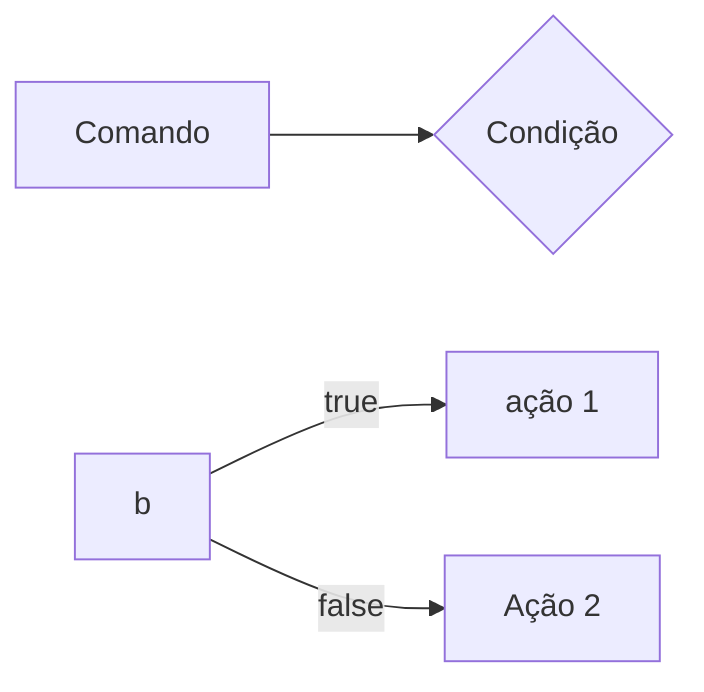
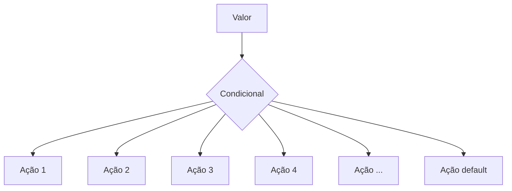
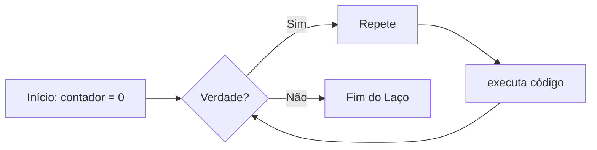
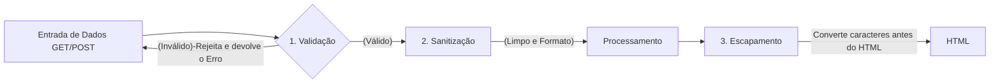

# Curso BackEnd - 225h - Tecnico em Desenvolvimento de Sistemas - SENAI
Prof Diogo TB

Escola SENAI Americana

2 Semestre 2026

## Objetivo Do Curso


- Desenvolver Aplicações web Server Side, utilizando a linguagem PHP; 
- Aplicar Sisntaxe Nativa PHP (Vanilla);
- Manipulação HTTP;
- Persistencia de dados
- Segurança contra SQL injection/CSRF;
- Refatoração em POO (Programação Orientada ao Objeto);
- Arquitetura MVC (MOdel, View, Controller);
- Utilização do FrameWork Laravel; 

obs: framework - um conjunto de bibliotecas que oferecem uma solução completa para o desenvolvimento de alguma coisa

## Cronograma do Semestre 

Carga horaria: 105h 1- Semestre e 120h 2- Semestre

### Semana 1: Introdução ao BackEnd e configuração do Ambiente PHP

#### O que é BackEnd?

Backend é a parte "de trás" de uma aplicação — tudo que roda no servidor e que o usuário não vê diretamente. Enquanto o frontend é o que aparece na tela (botões, layout, cores), o backend é responsável pela lógica, pelos dados e pelas regras que fazem o sistema funcionar de verdade.

# Para que serve
-Processar lógica de negócio: regras, cálculos, validações (ex: calcular frete, aplicar desconto, validar login)

-Gerenciar banco de dados: salvar, buscar, atualizar e deletar informações

-Autenticação e autorização: controlar quem pode acessar o quê (login, senhas, permissões)

-Fornecer APIs: criar "pontes" (endpoints) para o frontend ou outros sistemas consumirem dados

-Integração com serviços externos: pagamentos, e-mails, notificações, APIs de terceiros

-Segurança: proteger dados sensíveis, evitar ataques (SQL injection, XSS, etc.)

-Escalabilidade e performance: garantir que o sistema aguente muitos usuários ao mesmo tempo.

# Principais linguagens de backend
--Linguagem	Frameworks populares Pontos fortes--

-JavaScript/TypeScript	Node.js, Express, NestJS	Mesma linguagem do front, grande ecossistema, ótimo para I/O assíncrono

-Python	Django, Flask, FastAPI	Sintaxe simples, ótimo para dados, IA e prototipagem rápida

-Java	Spring Boot	Robusto, muito usado em grandes empresas e sistemas corporativos

-C#	.NET / ASP.NET	Forte no ecossistema Microsoft, corporativo

-PHP	Laravel, Symfony	Muito usado historicamente (WordPress, sites tradicionais)

-Go (Golang)	Gin, Fiber	Alta performance, ótimo para microsserviços

-Ruby	Ruby on Rails	Produtividade alta, foco em convenção sobre configuração

-Rust	Actix, Axum	Performance extrema e segurança de memória

-Kotlin	Ktor, Spring	Alternativa moderna ao Java

# Componentes essenciais do backend

-Servidor — onde a aplicação roda (ex: Nginx, Apache, ou o próprio runtime como Node.js)

-Banco de dados

-Relacionais (SQL): PostgreSQL, MySQL, SQL Server

-Não relacionais (NoSQL): MongoDB, Redis, Cassandra

-APIs — REST, GraphQL, gRPC (formas de comunicação entre front e back)

-Autenticação — JWT, OAuth, sessions

-Cache — Redis, Memcached (para acelerar respostas)

-Mensageria/filas — RabbitMQ, Kafka (para processar tarefas assíncronas)

-Cloud/Infraestrutura — AWS, GCP, Azure, Docker, Kubernetes


# Conceitos frequentemente citados na área

-API REST: arquitetura padrão para comunicação via HTTP (GET, POST, PUT, DELETE)

-CRUD: Create, Read, Update, Delete — operações básicas de dados

-MVC: padrão de arquitetura (Model-View-Controller)

-Microsserviços vs Monolito: formas de estruturar a aplicação (vários serviços pequenos vs um sistema único)

-Escalabilidade horizontal/vertical: aumentar capacidade adicionando máquinas ou melhorando a máquina existente

-ORM (Object-Relational Mapping): ferramentas como Prisma, SQLAlchemy, Hibernate que facilitam o acesso ao banco

-Testes automatizados: unitários, integração, e2e

-CI/CD: automação de deploy e entrega contínua

-Segurança: criptografia, HTTPS, tokens, sanitização de dados

# Backend vs Frontend vs Full Stack

-Frontend: interface, experiência visual (HTML, CSS, JS, React, Vue)

-Backend: lógica, dados, servidor

-Full Stack: desenvolvedor que trabalha nos dois lados


# Resumo em uma frase

Backend é o "cérebro invisível" de um sistema: recebe pedidos do frontend, processa regras de negócio, conversa com o banco de dados e devolve as respostas — tudo isso com segurança e performance.

#### O Ciclo de vida da requisição HTTP

#### O que é HTTP?

*HTTP*, Hypertext Transfer Protocol, é um protocolo de comunicação utilizando para transferencia de informações na www (World wide web) e em outros sitemas de rede.

O HTTP é a base para que o cliente e um servidor web troquem informações. ele permite a requisição e resposta de recursos como, imagens, arquivos e textos.


#### Como funciona na pratica o backend

- **Ação do usuario**: Envia uma solicitação pela UI(Interface do Usuário). Exemplo de UI: Tela do Celular, Navegador da Internet, Alexa, IOT ...
- **Enviar uma Requisição**: A UI transforma ação do Usuário em uma Requisição HTTP.
- **O Processamento BackEnd**: O Código BackEnd recebe o pedido, valida os dados e decide o que fazer. Ex: consultar uma informação no BD(Base de Dados).
- **Resposta**: O servidor devolve o resultado para a UI.
Ex: Um login autorizado, comfirmação de uma compra...

#### Tipos de Requisisção HTTP

Os tipos de requisição HTTP indicam a ação que o usario deseja executar no servidor. as principais ações são:

- **GET**: Pede dados de um lugar especifico do servidor.
"Não faz alterções no servidor"
- **DELETE**: Apaga um Dados do Servidor.
- **POST**: Envia dados novo para *criar* algo ou processar informações no servidor.
- **PUT/PATCH**: Modificaar um dados já existente. 

---

#### Iniciando o PHP

**PHP** (HyperText PrepProcessor ) é uma linguagem de progamação interpretada e open source, focada no desenvolvimento de sistemas para web, pode ser usada junto com html para criação de paginas web dinamicas.

O PHP de fato é uma das linguagens de programação mais populares da atualidade. Ela permite que você crie aplicações web robustas, de uma forma muito simplificada e direta. A linguagem tem diversos recursos que facilitam e aceleram o processo de desenvolvimento de siter e sistemas para web. E além do mais, ela ainda tem um otimo ecossistema, uma execelente comunidade e um grande mercado de trabalho. 

##### Instalando o PHP 
- Fazer o download do PHP em PHP.net
- zip - NTS (Non Thread safe) 8.5
- Descompactar o Arquivo do PHP na pasta C:src\php (para descompactar usar o zip = melhor) => nunca salvar arquivos ou programas na raiz do sistema (c:)
- Adicionar a Pasta do PHP(C:\src\php) as Variáveis de Ambiente do Sistema (PATH)
- Verificar a Instalação rodando o comando *php --version*

## É uma resposta a requisição do usuario.

#### Criando minha primeira aplicação em PHP

1. Amtes de começar a codar:

- Prepara meu VSCODE
   - Criar um profile proprio para PHP
   - Instalar Extensões necessarias para transformar o VScode em uma ide:
   - PHP intelephense => permite a utilização de snippets
   - PHP Debug => Ajuda a encontrar erros de codigo
   - PHP Cs Fixer => Formatação de codigos (identação)
   - PHP Server => ajuda na criação de um servidor local para PHP
   - Desabilitamos o PHP nativo do VScode (@builtin PPHP)

2. Hello world (muito importante)

#### Estudo de Variaveis e constantes em PHP

Declarar variaveis é alocar um espaço na memoria que permite a inclusão e manipulação de dados.

**Variaveis**

- devem ser declaradas usando "$" antes do nome da variavel
- São não tipadas ( não precisa declarar o tipo dela na criação)
- podem ser string, numericas ( integrar e float), booleanas e nulas. não permite declaração de undefined
- Usar o "declare(Strict_types=1);" na primeira linha do arquivo; => blinda o sistema contra conflitos de tipos de variaveis

**constantes**

- Não podem ser mudadas ou redeclaradas após a criação

- pode ser criada usando "const" ou "define"

- não permite interpoloção   

#### Estudo de operadores 

**Aritimeticos**: São usados para realizar calculos

| operador | Nome | Exemplo | Resultado |
| - | - | - | - |
| + | Adição | 10+5 | 15 |
| - | Subtração | 10-5 | 5 |
| * | Multiplicação | 10*5 | 50 |
| / | Divisão | 10/5 | 2 |
| % | Modulo(Resto) | 10%3 | 1 (10 div 3 dá 3 , sobra 1) |
| ** | Expoente | 2**3 | 8(2 elevado a 3) |

obs: O Operador % é o melhor amigo de um programador, permite ordenar listas e organizar fila de pilhas

**Relacionais**:  Permite o Relacionamento entre dois ou mais valores, o resultado de uma operação é sempre uma booleana (verdadeiro ou falso).

| Operador | Significado | Exemplo | Resultado |
| - |  - | - | - |
| > | Maior que | 18 > 18 | false |
| >= | Maior ou igual a | 18 >= 18 | true |
| < | Menor que | 10 < 20 | true |
| <= | Menor ou igual a | 10 <=5 | false |
| == | Comparação de valor | "10" ==10 | true | 
| === | Comparação Estrita | "10"===10 | false |
| != | Diferente | "10"!=10 | false |
| !== | Estritamente Diferente | "10"!==10 | true | 


**logicos**: Permite a Combinção entre sentnças.

- Operador AND (E) => && : para o resultado ser verdadeiro, Todas as Combinações precisam ser verdadeira
    - true && true => true
    - true && false => false

- Operador OR (OU) => || : para o resultado ser verdadeiro, Basta apenas uma condição ser verdadeira
    - false || true => true
    - false || false => false

- Operador NOT (Não) => ! : Inverte a lógica da Operação, 
    - !true => false
    - !false => true

    ---

    ### Semana 3 - Estrutura de Controle de Dados (Condicionais e Repetição)

- **Conteúdo**: Estrutura `if`, `else`, `elseif`, operadores ternários, `match` => substituto do `switch/case`, loops `for`, `while`, `do-while` e `foreach`

#### Estruturas de Controle da Dados Ajudam no Processo de Automatização em Programas e Sistemas

##### Condicionais (IF, ELSE, ELSEIF)

**Fromas de uso**

- Uso do `if` apenas: 
Exemplo: aplicar desconto de 10% em compras acima de 100 Reais;



```php

if($valorCompra > 100){
    $valorFinal = $valorCompra * 0.9;
}

```

- Uso do `if` e do `else`
Exemplo: Aplicar um desconto de 10% para comprar acima de 100reais e 5% para as demais compras



```php

    if($valorCompra > 100){
    $valorFinal = $valorCompra * 0.9;
} else {
    $valorFinal = $valorCompra * 0.95;
}

```

##### Operadores Ternários

Um atalho para a estrutura condicional `if/else, normalmente escrito em uma única linha de código.

` condição ? verdadeira : falsa `

Perfeito para decisões curtas de uma linha de comando

Exemplo: Verificar se a pessoa é maior de idade (18);

```php

$idade = 10;
//O formato é (Condição) ? Verdadeiro : Falso;

$status = ($idade>=18) ? "Maior de Idade" : "Menor de Idade";
$status2 = ($idade>=60) ? "Idoso" : ($idade>=18) ? "Adulto" : "Criança" ;

echo $status //

```

##### Expressão Condicional `match` (PHP 8)

No mercado atual de PHP, não se uma mais uma `Switch/Case` para chegar valores fixos, usa-se o `match`. Ele compara um valor e retoran diretamente o resultado caso atenda a condição.


Exemplo: Selecionar o Dia da Semana a partir de um Nº 

```php

$diaSemanaNum = date("W"); // pega o Dia da Semana em formato numérico

$nomeDiaSemana = match($diaSemanaNu) {
    "0" => "Domingo",
    "1" => "Segunda",
    "2" => "Terça",
    "3" => "Quarta",
    "4" => "Quinta",
    "5" => "Sexta",
    "6" => "Sábado",
    "default" => "Dia Inválido"
};

echo " Hoje é : $nomeDiaSemana";

```

---

##### Laços de Repetição

Um laço de repetição faz com que um bloco de código rode várias vezes até que uma condição mande parar. 

- O Laço `while` (Enquanto)

Ele verifica se a condição é verdadeira ANTES de entrar no laço. Ideal quando você não sabe exatamente quantas vezes vai rodar o laço. 



Exemplo de Aplicação do While:  jogo de Adivinhação de um nº Secreto

```php

$numeroSecreto = rand(1,10); 

$tentativas = 0;

$numero = 0;

while($numeroEscolhido != numeroSecreto){
    echo "Tente Novamente"
    //vou escolher N° para adivinhar
    numeroEscolhido = rand(1,10);
    tentativas++;
}

echo "Acertou miseravi!!! o n° secreto é $numeroEscolhido";

```

- O Laço `do-while` (Faça - enquanto)

A diferença é que ele executa o bloco pelo menos uma vez, mesmo que a condução seja falsa desde o inicio, pois ele só pergunta no final.

```mermaid

flowchart LR

    A([Inicio]) --> B[Ação]
    B --> C{Condição}
    C --true--> B
    C --false--> D([Fim])

    ```

    Exemplo: jogo de advinhação de um n°

    ```php
    
    $numeroSecreto = rand(1,10);

    do{
        $numeroEscolhido = rand(1,10);

        if(numeroEscolhido == numeroSecreto){
            echo "Parabéns, Acertou!!!";
            break;
        }
        echo "Tente Novamente!!!";

    } while(numeroEscolhido != numeroSecreto);


    ```

    #### O freio de emergencia: `break` e `continue`

    As vezes precisamoso interferir no laço enquanto ele está rodando 

- `break`=> **Para Tudo!** Quebra o laço interiro e avai embora
- `continue` => **Pula a rodada!** Ele ignora o código daquela rodada especifica e pula logo par a próxima repetição.

Exemplo de aplicação do codigo: Sistema de controle do elevador

```php 

for($andar = 1 ; $andar<=10; $andar++){
    if($andar ==4){
        echo "Andar $andar está em obras. Passando direto!";
        continue;
    }

    echo "Elevador parou no andar $andar"
}

``
---

##### Laço de Repetição `for`

Use o `for` quando você sabe quantas vezes precisa repetir uma ação ou quando precisa controle um contador. ele possui tres partes:

- inicialização,
- condição,
incremento;

for(inicialização; condição; incremento){}

```mermaid

flowchart LR
    A[Inicio: i=0]  --> B{i<10?}
    B --true--> C[Ação]
    C --> D[i++]
    D --> B
    B --false--> E[Fim]

```

Exemplo: Exibir todos os mese do ano 

```php
for($me=1; $mes<=12; $mes++){
    echo "Mês $mes";
}
```

Nesse Exemplo, `$mes` começa em 1, o laço continua enquanto `$mes` for menos ou igual a 12 e, ao final de cada repetição, `$mes++` aumenta o contador em 1.

##### Laço de repetição `foreach` 

Use o `foreach` quando precisar percorrer cada item de um *array*. ele acessa os elementos diretamente, sem que você precise controlar o contador.


```php

$frutas = ["Maça", "Banana", "Uva", "Pera"];

foreach($frutas as $fruta){
    echo "Fruta: $fruta";
}
```

Outro exemplo : acessar a chave eo valor de cada item:

```php

$precos = [
    "Caderno" => 25.90,
    "Caneta" => 5.50,
    "Mochila" => 99.00
]; // vetor não ordenado chave => valor

foreach ($precos as $produto => $preco){
    echo "$produto: R$ number_format($preço,2)";
}
```

---
---
#### Desafio : simulador de cobrança (FINANSENAI)

## SEMANA 4 - Modularização com Funções
### O Princípio do DRY (`Don't Repeat Yourself`)

Se uma lógica foi escrita duas vezes ou mais dentro de um código, essa lógica deve virar uma função.

---
### Funções Nativas do PHP

O PHP tem milhares de funções prontas, essas funções são chamadas de ***nativas***.

> **O que é uma função?**

Uma função é como uma máquina: você coloca uma matéria-prima ***(parâmetro)***, ela processa e devolve um produto final ***(retorno)***.

> -> **Exemplo de Função Nativa:**
```php
$texto = "senai americana";

// str_replace
$textoNovo = str_replace("americana","são paulo",$texto);

// strtoupper
echo strtoupper($textoNovo); // SENAI SÃO PAULO
```
---
### Principais Funções Nativas (mais utilizadas)

As funções abaixo já fazem parte do PHP e podem ser chamadas diretamente no código. Observe os parâmetros que cada uma recebe e o tipo de informação que ela retorna.

| Função | Categoria | O que faz | Como usar |
|---|---|---|---|
| `strlen()` | Strings | Retorna a quantidade de caracteres de um texto. | `$tamanho = strlen($texto);` |
| `strtoupper()` | Strings | Converte o texto para letras maiúsculas. | `$resultado = strtoupper($texto);` |
| `strtolower()` | Strings | Converte o texto para letras minúsculas. | `$resultado = strtolower($texto);` |
| `ucfirst()` | Strings | Converte a primeira letra do texto para maiúscula. | `$resultado = ucfirst($texto);` |
| `trim()` | Strings | Remove espaços e quebras de linha no início e no fim do texto. | `$limpo = trim($texto);` |
| `str_replace()` | Strings | Substitui uma parte do texto por outra. | `$novo = str_replace("-", "", $cpf);` |
| `substr()` | Strings | Extrai uma parte do texto a partir de uma posição. | `$inicio = substr($texto, 0, 3);` |
| `explode()` | Strings | Divide um texto e cria um array usando um separador. | `$palavras = explode(" ", $nome);` |
| `implode()` | Arrays | Junta os itens de um array em um único texto. | `$lista = implode(", ", $nomes);` |
| `count()` | Arrays | Conta a quantidade de itens de um array. | `$total = count($produtos);` |
| `in_array()` | Arrays | Verifica se um valor existe dentro de um array. | `$existe = in_array("SP", $estados, true);` |
| `array_push()` | Arrays | Adiciona um ou mais itens ao final de um array. | `array_push($nomes, "Ana");` |
| `array_pop()` | Arrays | Remove e retorna o último item de um array. | `$ultimo = array_pop($nomes);` |
| `sort()` | Arrays | Ordena um array em ordem crescente e reorganiza suas chaves. | `sort($notas);` |
| `array_keys()` | Arrays | Retorna um array contendo as chaves de outro array. | `$chaves = array_keys($produtos);` |
| `number_format()` | Números | Formata um número com casas decimais e separadores definidos. | `$preco = number_format($valor, 2, ',', '.');` |
| `round()` | Números | Arredonda um número para a quantidade de casas informada. | `$media = round($nota, 2);` |
| `max()` | Números | Retorna o maior valor de uma lista ou array. | `$maior = max($notas);` |
| `min()` | Números | Retorna o menor valor de uma lista ou array. | `$menor = min($notas);` |
| `is_numeric()` | Validação | Verifica se o valor é um número ou uma string numérica. | `if (is_numeric($entrada)) { ... }` |
| `isset()` | Validação | Verifica se uma variável existe e não possui valor `null`. | `if (isset($usuario)) { ... }` |
| `empty()` | Validação | Verifica se uma variável está vazia. | `if (empty($pedido)) { ... }` |
| `date()` | Data e hora | Formata uma data ou hora conforme uma máscara. | `$hoje = date('d/m/Y');` |
| `file_exists()` | Arquivos | Verifica se um arquivo ou diretório existe. | `if (file_exists('dados.txt')) { ... }` |
| `file_get_contents()` | Arquivos | Lê todo o conteúdo de um arquivo ou endereço. | `$conteudo = file_get_contents('dados.txt');` |
| `file_put_contents()` | Arquivos | Grava conteúdo em um arquivo, criando-o se necessário. | `file_put_contents('log.txt', $mensagem);` |

- **Atenção:** algumas funções modificam o array original, como `sort()`, `array_push()` e `array_pop()`. Já outras retornam um novo valor, como `count()`, `explode()` e `str_replace()`. Em caso de dúvida, consulte a documentação oficial do PHP e verifique o retorno da função.
---
#### Documentação PHP
> **Documentação PHP**:
[Acesse a documentação oficial do PHP em português](https://www.php.net/manual/pt_BR/)

> Consulte também: [Referência de funções do PHP](https://www.php.net/manual/pt_BR/funcref.php), para pesquisar a sintaxe, os parâmetros e os valores por cada função.
---
### Funções Customizadas (criando suas próprias máquinas)

Quando o PHP não tem a função desejada, nós a criamos!

***Regra de Ouro:*** Uma função deve focar em `return` (retornar um valor), e não em imprimir (`echo`).

> -> **Veja a diferença nesse exemplo:**
```php
function calcularTotal($preco, $quantidade){
    // a função calcula e retorna o resultado, mas não imprime nada
    return $preco * $quantidade;
}

$total = calcularTotal(25.00, 3);
echo "Total da compra: R$ " . number_format ($total, 2,",",".");
// Total da compra: R$ 75,00
```
> A função `calcularTotal()` pode ser utilizada em uma página, relatório ou teste. O `echo` aparece somente fora da função, no momento de apresentar o resultado ao usuário.
---
### Padrão de Uso Corporativo (PHP 8 Strict Types)

No mercado de trabalho, exigimos que a função avise exatamente o ***TIPO*** de dado que ela espera receber e o ***TIPO*** que ela vai devolver.

Isso é chamado de ***tipagem de funções***. Ao declarar os tipos, o código fica mais fácil de entender e o PHP consegue identificar alguns erros antes que eles causem problemas maiores no sistema.

Os tipos mais usados são:
- `int`: número inteiro (ex: 10, 1024...);
- `float`: número decimal ou ponto flutuante (ex: 10.50);
- `string`: texto (ex: "Texto");
- `bool`: valor lógico (true/false);
- `void`: identifica que a função não devolve nenhum valor.

> O **tipo** deve ser escrito antes do nome de cada ***parâmetro*** e o **tipo da função** deve ser escrito após os ***parênteses***, precedido por `:`, informando o que a função vai devolver.

**-> Exemplo de uso de função e parâmetros tipados:**
```php
function apresentarProduto(string $nome, float $preco): string{
    return "$nome custa R$ $preco";
}

$mensagem = apresentarProduto("Caderno", 25.90);
echo $mensagem;
// Caderno custa R$ 25.90
```
> ***Resumo:*** os **tipos dos parâmetros** documentam as entradas da função, o **tipo** após `:` documenta a saída da função.
---
### O Tipo Mágico: `void`

Se uma função faz um trabalho interno e **não retorna NADA**, dizemos que o retorno dela é vazio (`void`).

**-> Exemplo de função sem retorno:**
```php
function registroLog(string $mensagem): void{
    // apenas salvar em um arquivo de texto, não devolver nenhuma variável
    file_put_contents("erro.log", $mensagem);
}
```
---
### Escopo e Referência (o segredo da memória)

**- O que é Escopo? ***(A Regra de Las Vegas)*****

> *O que acontece dentro da função, fica dentro da função*. Uma variável criada fora não existe lá dentro, e uma criada lá dentro "morre" quando a função acaba.

**Escopo** é o local do programa onde a variável pode ser armazenada/acessada. Em PHP, uma variável criada fora de uma função pertence ao **escopo global**. Uma variável criada dentro de uma função pertence ao **escopo local**.

**-> Exemplo de Escopo de Variável:**

```php 
$nomeSistema = "CRM Senai"; // variável global

function criarMensagem():string{
    $mensagem = "Bem-Vindo(a)!"; // variável local
    return $mensagem;
}

echo $nomeSistema; // correto: está no escopo global.
echo criarMensagem(); // correto: a função devolve sua variável local.
echo $mensagem; // incorreto: $mensagem só existe dentro da função, não é acessada fora.
```
---
**- Como enviar dados para uma função?**

A forma mais segura e organizada é enviar os dados por **parâmetros**. Assim, a função não precisa acessar diretamente variáveis globais:
```php
function saudar(string $nome):string{
    return "Olá, $nome!";
}

$nomeCliente = "Mayne";
echo saudar($nomeCliente); // Olá, Mayne!
```
- Nesse caso, `$nomeCliente` continua no ***escopo global***, mas seu valor é enviado para o parâmetro local `$nome`. A função recebe uma informação, processa e retorna o resultado.

**-> Exemplo Incorreto:**
```php
$nome = "Mayne";
function saudar():string{
    return "Olá, $nome!";
}
```
- A função `saudar` não conhece a variável global `$nome`.
---
> ***Resumo:*** ***variáveis*** protegem os dados internos da função; ***parâmetros*** são o caminho recomendado para evitar erros e enviar informações; `return` é usado para devolver um resultado ao código que chamou a função.

---

### Semana 5 - Arrays e Manipulação Avançada de Dados

Um array(também conhecido como vetor) é uma estrutura de dados usadas para armazenar varios valores em uma unica variavel.

**Tipos de Arrays em PHP:**

- Indexados/Ordenado(Numerica): Usam numeros inteiros como indices(chaves) que começam em zero por padrão;
- Associativos/Não ordenados (string): Usam chaves(String) para identificar valores;
- Multidimensionais: Contem um ou mais arrays dentro de outro array.

**Exemplos de Arrays:**

```php
//array indexado
$frutas = ["Maça", "bana", "laranja"];

//array asociativo
$capitais = [
    "SP" => "São paulo",
    "RJ" => "Rio de Janeiro",
    "MG" => "Belo Horizonte",
    "ES" => "Vitoria",
];

//Acessando os dados dos arrays

echo $frutas[1]; // banana
echo $capitais["MG"]; //Belo horizonte
```

> obs: Em arrays associativos, nos trocamos os n° do indice por nomes(Chaves/keys). Na declaração do vetor usamos setinha(=>) que significa "recebe"

#### Arrays Multidimensionais (Banco de dados na memoria)

É aqui que o backend começa de verdade. o array Multidimensional é o formato como os bancos de dados e apis respondem as solicitações pelo BackEnd.

**Exemplo de array Multidimensional:**

```php
$cliente = [
    ["id" => 1, "nome" => "ana", "email" => "ana@email.com", "ativo" => true],
    ["id" => 2, "nome" => "bruno", "email" => "bruno@gmail.com", "ativo" => false],
    ["id" => 3, "nome" => "carlos", "email" => "carlos@hotmail.com", "ativo" => true],
];

//Como acessar o email do carlos
echo $clientes[2]["email"]; // carlos@hotmail.com
```

#### O melhor amigo dos Array: `O Foreach`

O laço de repetição especial para arrays. O `foreach` percorre cada elementos de um array

**Exemplo de Aplicação:**

```php
foreach($clientes as $clienteAtual){
    echo $clienteAtual["nome"];
    echo $clienteAtual["email"];
}
// vai imprimir nome e email de todos os clientes do array
```

#### Transformação de arrays e arrow functions

Transformações de arrays são usadas para modificar ou filtrar informações de um array existente

- `array_filter`
Serve para buscar dados em um array e devolver apenas os dados que passarem pelo filtro

```php
$clientesAtivos = array_filter($clientes, fn($c) => $c["ativo"]===true);
//novo array , tera apenas os clientes que a chave ativo for igual a true
```

- `array_map`
Serve para alterar Todos os dados de um array de uma única vez

```php
$produtos = [
    ["id"=>1, "preco"=10.00, "setor"=>"jardim"],
    ["id"=>2, "preco"=15.90, "setor"=>"ferramenta"],
    ["id"=>3, "preco"=23.50, "setor"=>"jardim"],
]
//ajustar o preço de todos os produtos em 10% de aumento

$produtosAjustados = array_map(fn($p) => $p["preco"] = $p["preco"]*1.1, $produtos);
```

> Obs: para a função de filtragem, o primeiro selecionamos a array e depois criamos o filtro. para a função de mapeamento, primeiro criamos a função de transformação e depois aplicamos no array.

#### Debugando um Array (Kit de primeiro Soccoros)

- `print_r`
função usada para exibir informações sobre um array de forma legível em liguagem natural

```php
echo print_r($frutas);
//array
(
    [0] => "maça",
    [1] => "banana",
    [2] => "laranja"
)
```

- `var_dump`
Exibi com mais detalhes as informações de um array ou variável em PHP

```php 
echo var_dump($frutas);
// Mostra tudo: tipo de dados, o tamanho e o valor
```

---

### Semana 6 - Processamento de HTTP e Formularios web

#### Anatomia de um formulario HTML para Backend

Antes do PHP processar qualquer informação, precisamos coletar informações no frontEnd atraves de um `<form>`

**Exemplo de `<form>` HTML**

```html
<form acction="processar.php" method="POST">
    <label>Nome completo</label>
    <input type:"text" id="campoNome"
    name="nomeUsuario" placeholder="Digite seu nome">
    <button type="submit">Cadastrar</button>
</form>
```

**Os 3 Pilares de um formulário**
1. action="processa.php" -> O Destino : Define qual script PHP no servidor recebrá os dados
2. method="POST" -> O Transporte: Define a via de protocolo HTTP que será usada (GET ou POST)
3. name="nomeUsuario" -> A Etiqueta do Dado: É o nome da chave que o PHP usará no array associativo  ($_POST["nomeUsuario"])

> obs: Nunca Confundir `id`com `name`no input, o PHP ignora o `id`.

#### O Protocolo HTTP

Quando o usuário clica no botão `type="submit"`, o navegador compila todas as informações dos campos preenchido e dispara um pacote de comunicação padronizado pelo **Protocolo HTTP(Hypertext Transfer Protocol)**.

**Os Formatos de Transferência**

* **Método GET**: solcitar informações públicas e realizr buscas, mas altamente arriscado para dados privados.
* **Método POST**: As informações viajam guardadas dentro do protocolo. 

#### Testar o uso dos Protocolos HTTP

ok

#### GET vs. POST

1. O metodo GET(Consultas e filtros)

o método `GET` é utilizado quando a intenção do cliente é **buscar ou filtrar dados** sem alterar o estado do servidor. Os dados enviados via `GET` são anexados diretamente ao final da URL na forma de uma **Query String** 

2. O Método POST (Envio de cargas uteis e Mutações)

o método `post` é utilizado quando o formulario envia dados que devem ser processados para **criar ou modificar registros** no sistema (Ex: cadastro de usuarios, finalizações de compra, upload de arquivos)

#### As SuperGlobais

As Variáveis SuperGlobais são arrays intrnos pré-definidos que estão sempre acessíveis em qualquer parte do script php, sem precisar declarar. 

- **$_GET**: Armazena dados passados pela URL via parêmetros de consulta(query string);
- **$_POST**: Recolhe dados enviados por formulários usando método HTTP POST.
- **$_SERVER**: Contém informações sobre o servidor, ambiente e caminhos de script

**Porque usar `??` para obter dados da SuperGlobal**?

Usamos o Operador de Nulidade (Coalescência Nula) para verificar se o valor da variável não é `null`, se caso for `null` atribuimos um outro valor para evitar erros no script.

**Exemplo de Uso**:

Na primeira vez que uma página é aberta, o formulário ainda não foi enviado. Portanto, a achave pode não existir no array.

```PHP
$nome = $_POST["nome"]; 
// escrevendo desta forma, o código pode gerar um aviso de erro. 

// a forma mais correta de escrita é 
$nome = $_POST["nome"] ?? "";
//Se $_POST["nome"] não existir, use uma string vazia. 

//outra forma de verificar nulidade é usando if else
if(isset($_POST["nome"])){
    $nome = $_POST["nome"];
} else{
    $nome = "";
}
```

>obs: use htmlspecialchars() ao exibir valor em HTML => converte caracteres especiais em entidades correspondentes em HTML, evitando que o código seja interpretado erradamente pelo navegador. É usado principalmente na segurança web para evitar ataques Cross-Site-Scripting(XSS).

#### Validação de Dados no BACKEnd é Obrigatória.

Muitos desenvolvedores iniciantes acreditam que colocar atributos `required`, `type=email`ou `min=0`na <tag> do HTML é suficiente para proteger o sistema. **Isso é uma ilusão!**. Sempre fazer as validações de dados no código BackEnd

##### Funções Nativas Essenciais para Limpeza e Validação de Dados

A validação no Back-End deve acontecer sempre antes do processamento de qualquer dado recebido pelo usuário. Abaixo está uma tabela resumida das funções nativas do PHP usadas com frequência para limpar, verificar e validar entradas de formulário.

| Função | Descrição | Quando usar | Exemplo simples |
| :--- | :--- | :--- | :--- |
| `trim($valor)` | Remove espaços no início e no fim da string | Limpar texto digitado pelo usuário | `$nome = trim($_POST['nome'] ?? '');` |
| `htmlspecialchars($valor, ENT_QUOTES, 'UTF-8')` | Converte caracteres especiais em entidades HTML seguras | Exibir dados na tela sem risco de XSS | `echo htmlspecialchars($_POST['nome'] ?? '', ENT_QUOTES, 'UTF-8');` |
| `filter_var($valor, FILTER_VALIDATE_EMAIL)` | Valida formato de e-mail | Campos de e-mail | `filter_var($email, FILTER_VALIDATE_EMAIL)` |
| `filter_var($valor, FILTER_VALIDATE_INT)` | Verifica se o valor é inteiro válido | Idade, código, quantidade | `filter_var($_POST['idade'] ?? '', FILTER_VALIDATE_INT)` |
| `filter_var($valor, FILTER_VALIDATE_FLOAT)` | Verifica se o valor é número decimal válido | Preço, peso, altura, salário | `filter_var($_POST['preco'] ?? '', FILTER_VALIDATE_FLOAT)` |
| `isset($variavel)` | Verifica se uma variável existe e não é `null` | Garantir que o campo foi enviado | `if (isset($_POST['nome'])) { ... }` |
| `empty($valor)` | Verifica se o valor está vazio | Campos obrigatórios | `if (empty($_POST['senha'])) { ... }` |
| `strlen($valor)` | Retorna o tamanho da string | Exigir mínimo ou máximo de caracteres | `if (strlen($senha) < 6) { ... }` |
| `in_array($valor, $lista, true)` | Verifica se o valor pertence a uma lista permitida | `select`, `radio`, opções válidas | `in_array($categoria, ['A','B','C'], true)` |
| `is_numeric($valor)` | Confirma se o valor é numérico | Validação de número | `if (is_numeric($_POST['quantidade'])) { ... }` |
| `preg_match($padrao, $valor)` | Valida por expressão regular | CPF, CEP, telefone, senha forte | `preg_match('/^\d{5}-\d{3}$/', $cep)` |
| `filter_input(INPUT_POST, 'campo', FILTER_SANITIZE_SPECIAL_CHARS)` | Captura e limpa dados da requisição | Ler entradas com segurança | `$nome = filter_input(INPUT_POST, 'nome', FILTER_SANITIZE_SPECIAL_CHARS);` |


#### Preservação de Estado em Formulários (*Sticky Form*)

A técnica do **Sticky Form** consiste em imprimir de volta no atributo "value" do input os dados que o usuário acaba de digitar caso ocorra um erro de validação de dados. 

**Exemplo de Uso:**

```php
<div class="campo">
    <label for="nome">Nome Completo</label>
    <input type="text" id="nome" name="nome" 
        value="<?= htmlspecialchars($dadosFormulario["nome"] ?? "") ?>
        class="<?= isset($erro["nome"]) ? "input-erro" : "" ?>">
    <?php if (isset($erro["nome"])): ?>
        <span class="erro-texto"><?= $erro["nome"] ?></span>
    <?php endif; ?>
</div>
```


#### A Anatomia de um Ataque: O que é Cross-Site Scripting (XSS)

O XSS ocorre quando uma aplicação web inclui dados não confiaveis em uma página web sem a devida validação ou escape de caracteres. Isso permite que um atacante execute scripts maliciosos(geralmente em javaScript) diretamente no navegador de outro usuário que visitam o site.

**As principais modalidades de ataques:**
1. *Roubo de sessão(Cookie stealing)*: O Java script injetado le os cookies de autenticação da vitima (documente.cookie) e os envie para o servidor do atacante, permitindo que ele faça login na conta da vitima sem precisar de senha.

2. *Desconfiando do Site(Defacement)*: Alterar visualmente o site, inserindo mensagens falsas, banners ofensivos ou formularios de login fraudulentos (phising interno).

3. *Redirecionamento Malicioso*: Força o navegador da víima a abrir sites com vírus ou páginas clonadas de banco.

4. *Captura de Teclas(Keylogger)*: Grava tudo o que a vítima digita enquanto a página estiver aberta.


**Os vetores de ataques mais frenquentes:**


Nem todo ataque XSS usa a tag óbvia `<script>`. Desenvolvedores que tentam bloquear XSS apenas "apagando a palavra script" são facilmente burlados por atacantes:

| Vetor de Injeção | Como funciona o ataque? |
| :--- | :--- |
| `<script>alert('XSS')</script>` | Injeção direta de bloco de script executável pelo navegador. |
| `` | O navegador tenta carregar a imagem inexistente e dispara o evento `onerror` com o JavaScript. |
| `<svg onload="alert('XSS')">` | O navegador renderiza o elemento gráfico SVG e executa o evento `onload`. |
| `<a href="javascript:alert('XSS')">Clique</a>` | O clique no link executa a pseudo-URL com JavaScript em vez de abrir um site. |
| `"><script>alert('XSS')</script>` | Usado quando o dado é impresso dentro de um `<input value="...">`, quebrando o atributo e injetando a tag. |


### **A Triade da defesa: validação, sanitização e escapamento**



1. **Validação**: Verifica se o dado recebido atende aos requisitos exatos do sistema (tipo, tamanho, formato).

Ex: Verificar se o e-mail possui `@` e dominio válido (`filter_var($email, FILTER_VALIDATE_EMAIL)`).

2. **Sanitização**: Transforma o dado para adequalo ao formato desejado, removendo caracteres indesejados

Ex: Remover espaços no inicio e fim (`trim($nome)`)

3. **Escapamento/Codificação de Saida**: é o ato de converter caracteres especiais de linguagem html em suas respectivas
**Entidades HTML** no momento exato em que eles são impressos na tela.

Ex: usar `htmlspecialchars()`


#### **A Ferramenta principal: `htmlspecialchars()`**

A função `htmlspecialchars()` é o principal mecanismo do php para neutralizar xss na camada de apresentação

**Como a conversão de entidades funciona?**


| Caractere Original | Entidade HTML Gerada | Efeito no Navegador |
| :---: | :---: | :--- |
| `<` | `&lt;` (*Less Than*) | O navegador exibe `<` na tela, mas **não cria uma tag**. |
| `>` | `&gt;` (*Greater Than*) | O navegador exibe `>` na tela sem fechar tags. |
| `"` | `&quot;` (*Quotation Mark*) | Não quebra atributos HTML `<input value="...">`. |
| `'` | `&#039;` ou `&apos;` | Protege strings envoltas em aspas simples. |
| `&` | `&amp;` (*Ampersand*) | Evita interpretação incorreta de entidades. |

**A Sitaxe no PHP**

```php
string htmlspcialchars(
    string $string,
    int $flags = ENT_QUOTES | ENT_SUBSTITUTE | ENT_HTML5,
    ?string $encoding = "UTF-8"
);
```
- **`ENT_QUOTES`**: Converte tatos aspas duplas quanto aspas simples. Essencial para saidas em atributos HTML
- **`ENT_SUBSTITUTE`**: Substitui a sequencias de bytes invalidos por caracteres de substituição unicode em vez de retornar uma string vazia
- **`ENT_HTML5`**: Aplica a tabela de entidades compativeis com a especificação HTML5
- **`UTF-8`**: Garante que caracteres da lingia portuguesa (como "ç", "ã", "é") sejam preservados sem corrupção.

**A função Helper de escapamento**

Para não precisar digitar essa linha extensa em todas as partes de saida de texto para HTML, os desenvolvedores profissionais criam uma função auxiliar curta:

```php
function e(string $texto):string {
    return htmlspecialchars($texto, ENT_QUOTES | ENT_SUBSTITUTE | ENT_HTML5, "UTF-8");
}

<p>Comentário: <?= e($comentarioUsuario) ?></p>
<input type="text" name="nome" value="<? e($nomeUsuario) ?>"/>
```

#### **Validação e Sanitização com uso de `filter_var()`**

O PHP possui a biblioteca de filtros nativos `filter_var()`. Observe os filtros mais importantes do ecossistema corporativo:

```php
<?php
declare(strict_types=1);

// 1. Validação de E-mail
$email = "usuario.teste@senai.br";
if (filter_var($email, FILTER_VALIDATE_EMAIL) !== false) {
    // E-mail válido
}

// 2. Validação de Número Inteiro com Limites (Range)
$idade = "25";
$opcoesIdade = [
    'options' => [
        'min_range' => 16,
        'max_range' => 120
    ]
];
if (filter_var($idade, FILTER_VALIDATE_INT, $opcoesIdade) !== false) {
    // Idade é um inteiro entre 16 e 120
}

// 3. Validação de URLs (Links)
$website = "https://www.sp.senai.br";
if (filter_var($website, FILTER_VALIDATE_URL) !== false) {
    // URL possui protocolo e formato válidos
}

// 4. Validação de Endereço IP
$ip = "192.168.1.100";
if (filter_var($ip, FILTER_VALIDATE_IP) !== false) {
    // IP válido
}
```


