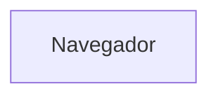
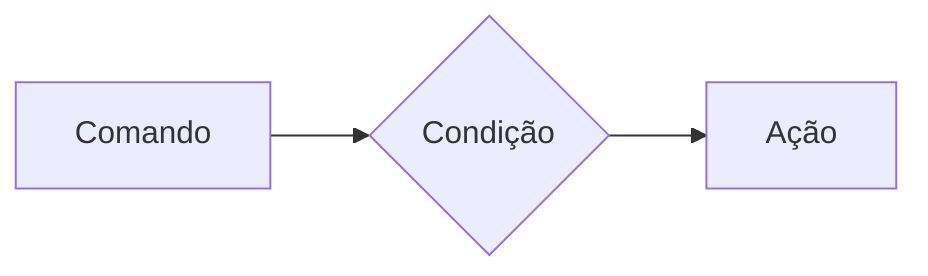

# Curso BackEnd - 225h - Tecnico em Desenvolvimento de Sistemas - SENAI
Prof Diogo TB

Escola SENAI Americana

2 Semestre 2026

## Objetivo Do Curso


- Desenvolver Aplicações web Server Side, utilizando a linguagem PHP; 
- Aplicar Sisntaxe Nativa PHP (Vanilla);
- Manipulação HTTP;
- Persistencia de dados
- Segurança contra SQL injection/CSRF;
- Refatoração em POO (Programação Orientada ao Objeto);
- Arquitetura MVC (MOdel, View, Controller);
- Utilização do FrameWork Laravel; 

obs: framework - um conjunto de bibliotecas que oferecem uma solução completa para o desenvolvimento de alguma coisa

## Cronograma do Semestre 

Carga horaria: 105h 1- Semestre e 120h 2- Semestre

### Semana 1: Introdução ao BackEnd e configuração do Ambiente PHP

#### O que é BackEnd?

Backend é a parte "de trás" de uma aplicação — tudo que roda no servidor e que o usuário não vê diretamente. Enquanto o frontend é o que aparece na tela (botões, layout, cores), o backend é responsável pela lógica, pelos dados e pelas regras que fazem o sistema funcionar de verdade.

# Para que serve
-Processar lógica de negócio: regras, cálculos, validações (ex: calcular frete, aplicar desconto, validar login)

-Gerenciar banco de dados: salvar, buscar, atualizar e deletar informações

-Autenticação e autorização: controlar quem pode acessar o quê (login, senhas, permissões)

-Fornecer APIs: criar "pontes" (endpoints) para o frontend ou outros sistemas consumirem dados

-Integração com serviços externos: pagamentos, e-mails, notificações, APIs de terceiros

-Segurança: proteger dados sensíveis, evitar ataques (SQL injection, XSS, etc.)

-Escalabilidade e performance: garantir que o sistema aguente muitos usuários ao mesmo tempo.

# Principais linguagens de backend
--Linguagem	Frameworks populares Pontos fortes--

-JavaScript/TypeScript	Node.js, Express, NestJS	Mesma linguagem do front, grande ecossistema, ótimo para I/O assíncrono

-Python	Django, Flask, FastAPI	Sintaxe simples, ótimo para dados, IA e prototipagem rápida

-Java	Spring Boot	Robusto, muito usado em grandes empresas e sistemas corporativos

-C#	.NET / ASP.NET	Forte no ecossistema Microsoft, corporativo

-PHP	Laravel, Symfony	Muito usado historicamente (WordPress, sites tradicionais)

-Go (Golang)	Gin, Fiber	Alta performance, ótimo para microsserviços

-Ruby	Ruby on Rails	Produtividade alta, foco em convenção sobre configuração

-Rust	Actix, Axum	Performance extrema e segurança de memória

-Kotlin	Ktor, Spring	Alternativa moderna ao Java

# Componentes essenciais do backend

-Servidor — onde a aplicação roda (ex: Nginx, Apache, ou o próprio runtime como Node.js)

-Banco de dados

-Relacionais (SQL): PostgreSQL, MySQL, SQL Server

-Não relacionais (NoSQL): MongoDB, Redis, Cassandra

-APIs — REST, GraphQL, gRPC (formas de comunicação entre front e back)

-Autenticação — JWT, OAuth, sessions

-Cache — Redis, Memcached (para acelerar respostas)

-Mensageria/filas — RabbitMQ, Kafka (para processar tarefas assíncronas)

-Cloud/Infraestrutura — AWS, GCP, Azure, Docker, Kubernetes


# Conceitos frequentemente citados na área

-API REST: arquitetura padrão para comunicação via HTTP (GET, POST, PUT, DELETE)

-CRUD: Create, Read, Update, Delete — operações básicas de dados

-MVC: padrão de arquitetura (Model-View-Controller)

-Microsserviços vs Monolito: formas de estruturar a aplicação (vários serviços pequenos vs um sistema único)

-Escalabilidade horizontal/vertical: aumentar capacidade adicionando máquinas ou melhorando a máquina existente

-ORM (Object-Relational Mapping): ferramentas como Prisma, SQLAlchemy, Hibernate que facilitam o acesso ao banco

-Testes automatizados: unitários, integração, e2e

-CI/CD: automação de deploy e entrega contínua

-Segurança: criptografia, HTTPS, tokens, sanitização de dados

# Backend vs Frontend vs Full Stack

-Frontend: interface, experiência visual (HTML, CSS, JS, React, Vue)

-Backend: lógica, dados, servidor

-Full Stack: desenvolvedor que trabalha nos dois lados


# Resumo em uma frase

Backend é o "cérebro invisível" de um sistema: recebe pedidos do frontend, processa regras de negócio, conversa com o banco de dados e devolve as respostas — tudo isso com segurança e performance.

#### O Ciclo de vida da requisição HTTP

#### O que é HTTP?

*HTTP*, Hypertext Transfer Protocol, é um protocolo de comunicação utilizando para transferencia de informações na www (World wide web) e em outros sitemas de rede.

O HTTP é a base para que o cliente e um servidor web troquem informações. ele permite a requisição e resposta de recursos como, imagens, arquivos e textos.


#### Como funciona na pratica o backend

- **Ação do usuario**: Envia uma solicitação pela UI(Interface do Usuário). Exemplo de UI: Tela do Celular, Navegador da Internet, Alexa, IOT ...
- **Enviar uma Requisição**: A UI transforma ação do Usuário em uma Requisição HTTP.
- **O Processamento BackEnd**: O Código BackEnd recebe o pedido, valida os dados e decide o que fazer. Ex: consultar uma informação no BD(Base de Dados).
- **Resposta**: O servidor devolve o resultado para a UI.
Ex: Um login autorizado, comfirmação de uma compra...

#### Tipos de Requisisção HTTP

Os tipos de requisição HTTP indicam a ação que o usario deseja executar no servidor. as principais ações são:

- **GET**: Pede dados de um lugar especifico do servidor.
"Não faz alterções no servidor"
- **DELETE**: Apaga um Dados do Servidor.
- **POST**: Envia dados novo para *criar* algo ou processar informações no servidor.
- **PUT/PATCH**: Modificaar um dados já existente. 

---

#### Iniciando o PHP

**PHP** (HyperText PrepProcessor ) é uma linguagem de progamação interpretada e open source, focada no desenvolvimento de sistemas para web, pode ser usada junto com html para criação de paginas web dinamicas.

O PHP de fato é uma das linguagens de programação mais populares da atualidade. Ela permite que você crie aplicações web robustas, de uma forma muito simplificada e direta. A linguagem tem diversos recursos que facilitam e aceleram o processo de desenvolvimento de siter e sistemas para web. E além do mais, ela ainda tem um otimo ecossistema, uma execelente comunidade e um grande mercado de trabalho. 

##### Instalando o PHP 
- Fazer o download do PHP em PHP.net
- zip - NTS (Non Thread safe) 8.5
- Descompactar o Arquivo do PHP na pasta C:src\php (para descompactar usar o zip = melhor) => nunca salvar arquivos ou programas na raiz do sistema (c:)
- Adicionar a Pasta do PHP(C:\src\php) as Variáveis de Ambiente do Sistema (PATH)
- Verificar a Instalação rodando o comando *php --version*

## É uma resposta a requisição do usuario.

#### Criando minha primeira aplicação em PHP

1. Amtes de começar a codar:

- Prepara meu VSCODE
   - Criar um profile proprio para PHP
   - Instalar Extensões necessarias para transformar o VScode em uma ide:
   - PHP intelephense => permite a utilização de snippets
   - PHP Debug => Ajuda a encontrar erros de codigo
   - PHP Cs Fixer => Formatação de codigos (identação)
   - PHP Server => ajuda na criação de um servidor local para PHP
   - Desabilitamos o PHP nativo do VScode (@builtin PPHP)

2. Hello world (muito importante)

#### Estudo de Variaveis e constantes em PHP

Declarar variaveis é alocar um espaço na memoria que permite a inclusão e manipulação de dados.

**Variaveis**

- devem ser declaradas usando "$" antes do nome da variavel
- São não tipadas ( não precisa declarar o tipo dela na criação)
- podem ser string, numericas ( integrar e float), booleanas e nulas. não permite declaração de undefined
- Usar o "declare(Strict_types=1);" na primeira linha do arquivo; => blinda o sistema contra conflitos de tipos de variaveis

**constantes**

- Não podem ser mudadas ou redeclaradas após a criação

- pode ser criada usando "const" ou "define"

- não permite interpoloção   

#### Estudo de operadores 

**Aritimeticos**: São usados para realizar calculos

| operador | Nome | Exemplo | Resultado |
| - | - | - | - |
| + | Adição | 10+5 | 15 |
| - | Subtração | 10-5 | 5 |
| * | Multiplicação | 10*5 | 50 |
| / | Divisão | 10/5 | 2 |
| % | Modulo(Resto) | 10%3 | 1 (10 div 3 dá 3 , sobra 1) |
| ** | Expoente | 2**3 | 8(2 elevado a 3) |

obs: O Operador % é o melhor amigo de um programador, permite ordenar listas e organizar fila de pilhas

**Relacionais**:  Permite o Relacionamento entre dois ou mais valores, o resultado de uma operação é sempre uma booleana (verdadeiro ou falso).

| Operador | Significado | Exemplo | Resultado |
| - |  - | - | - |
| > | Maior que | 18 > 18 | false |
| >= | Maior ou igual a | 18 >= 18 | true |
| < | Menor que | 10 < 20 | true |
| <= | Menor ou igual a | 10 <=5 | false |
| == | Comparação de valor | "10" ==10 | true | 
| === | Comparação Estrita | "10"===10 | false |
| != | Diferente | "10"!=10 | false |
| !== | Estritamente Diferente | "10"!==10 | true | 


**logicos**: Permite a Combinção entre sentnças.

- Operador AND (E) => && : para o resultado ser verdadeiro, Todas as Combinações precisam ser verdadeira
    - true && true => true
    - true && false => false

- Operador OR (OU) => || : para o resultado ser verdadeiro, Basta apenas uma condição ser verdadeira
    - false || true => true
    - false || false => false

- Operador NOT (Não) => ! : Inverte a lógica da Operação, 
    - !true => false
    - !false => true

    ---

    ### Semana 3 - Estrutura de Controle de Dados (Condicionais e Repetição)

- **Conteúdo**: Estrutura `if`, `else`, `elseif`, operadores ternários, `match` => substituto do `switch/case`, loops `for`, `while`, `do-while` e `foreach`

#### Estruturas de Controle da Dados Ajudam no Processo de Automatização em Programas e Sistemas

##### Condicionais (IF, ELSE, ELSEIF)

**Fromas de uso**

- Uso do `if` apenas: 
Exemplo: aplicar desconto de 10% em compras acima de 100 Reais;



```php

if($valorCompra > 100){
    $valorFinal = $valorCompra * 0.9;
}

```

- Uso do `if` e do `else`
Exemplo: Aplicar um desconto de 10% para comprar acima de 100reais e 5% para as demais compras

```mermaid

graph LR

    A[Comando] --> B{Condição}
    b --> |true| c[ação 1]
    b --> |false| D[Ação 2]

    ```

    ```php

    if($valorCompra > 100){
    $valorFinal = $valorCompra * 0.9;
} else {
    $valorFinal = $valorCompra * 0.95;
}

```


